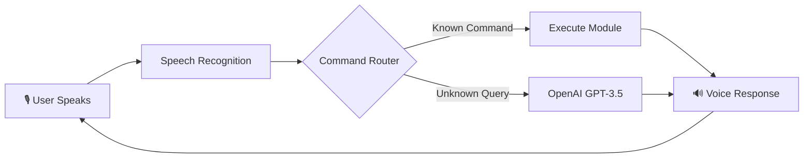

<div align="center">


#  ALEX. — Personal AI Desktop Assistant

### _"Just A Rather Very Intelligent System"_

[](https://python.org)
[](https://openai.com)
[](https://www.microsoft.com/windows)
[](LICENSE)
[]()

<br/>

> **A voice-controlled AI desktop assistant** built with Python that combines  
> **speech recognition**, **natural language processing**, and **system automation**  
> to deliver a hands-free productivity experience on Windows.

<br/>

[🚀 Quick Start](#-quick-start) •
[✨ Features](#-features) •
[🏗️ Architecture](#️-architecture) •
[📦 Installation](#-installation) •
[🎯 Usage](#-usage) •
[🛠️ Tech Stack](#️-tech-stack)

</div>

---

## 🎬 Demo

https://github.com/user-attachments/assets/demo-placeholder

> _Jarvis responding to voice commands: controlling brightness, sending a WhatsApp message, and fetching weather data — all hands-free._

---

## ✨ Features

<table>
<tr>
<td width="50%">

### 🎙️ Voice Intelligence
- **Real-time speech recognition** with Google Speech API
- **Natural language processing** via OpenAI GPT-3.5
- **Context-aware conversations** with conversation history
- **Text-to-speech responses** with pyttsx3 engine
- **Time-aware greetings** (morning / afternoon / evening)

</td>
<td width="50%">

### 💻 System Control
- **Brightness control** — increase / decrease screen brightness
- **Volume control** — fine-grained audio adjustment via Windows Core Audio API
- **Application management** — open & close Notepad, Paint, Settings
- **System shutdown** with voice confirmation safeguard
- **Battery monitoring** — real-time battery % and plug status

</td>
</tr>
<tr>
<td width="50%">

### 📡 Communication Hub
- **WhatsApp messaging** — send messages via voice dictation
- **Email dispatch** — compose and send emails hands-free
- **Phone calls** — initiate calls via Twilio integration
- **Google Search** — voice-triggered web searches
- **YouTube playback** — play any video by name

</td>
<td width="50%">

### 🧰 Productivity Suite
- **Voice notes** — dictate and auto-save timestamped `.txt` files
- **Screenshots** — capture screen with a single voice command
- **Weather reports** — live weather data from OpenWeatherMap API
- **Music player** — play local MP3 files with playback controls
- **Alarm clock** — set alarms in 12h/24h format with audio alerts
- **Webcam control** — open camera and capture photos by voice

</td>
</tr>
</table>

### 🎵 Bonus: Jarvis Can Sing!
Ask Jarvis to _"sing me a song"_ and it will perform lyrics from popular tracks like **Shape of You**, **Blinding Lights**, and **Levitating** using its text-to-speech engine. 🎤

---

## 🏗️ Architecture

<div align="center">


</div>

The system follows a **modular architecture** with clean separation of concerns:

```
Jarvis/
├── main.py              # 🧠 Core engine — voice loop, command routing, and AI fallback
├── gui.py               # 🖥️  GUI — Tkinter window with looping video background
├── communication.py     # 📡 WhatsApp, Email, and Twilio phone call modules
├── utilities.py         # 🧰 Voice notes and screenshot utilities
├── music_player.py      # 🎵 Pygame-based local music player with queue
├── openai_api.py        # 🤖 OpenAI GPT integration layer
├── config.py            # 🔐 API key configuration (gitignored)
├── requirements.txt     # 📦 Python dependencies
└── dist/
    └── main.exe         # 📦 Standalone Windows executable (PyInstaller)
```

### 🔁 How It Works



1. **Listen** — The microphone captures audio via `SpeechRecognition`
2. **Interpret** — Google Speech API converts speech → text
3. **Route** — The command router matches keywords to actions
4. **Execute** — The appropriate module handles the task
5. **Fallback** — Unrecognized queries are sent to **OpenAI GPT-3.5** for intelligent responses
6. **Respond** — Results are spoken aloud via `pyttsx3` text-to-speech

---

## 🛠️ Tech Stack

| Layer | Technology | Purpose |
|:------|:-----------|:--------|
| **Language** | Python 3.10+ | Core runtime |
| **AI / NLP** | OpenAI GPT-3.5 Turbo | Conversational AI fallback |
| **Speech-to-Text** | Google Speech Recognition API | Voice command capture |
| **Text-to-Speech** | pyttsx3 (SAPI5 on Windows) | Voice responses |
| **GUI** | Tkinter + OpenCV + Pillow | Animated video interface |
| **Audio Control** | pycaw (Windows Core Audio) | System volume management |
| **Brightness** | screen-brightness-control | Display brightness control |
| **Messaging** | pywhatkit | WhatsApp integration |
| **Phone Calls** | Twilio REST API | Voice call initiation |
| **Email** | smtplib (SMTP/TLS) | Email dispatch |
| **Weather** | OpenWeatherMap API | Real-time weather data |
| **Music** | pygame.mixer | Local audio playback |
| **Automation** | pyautogui, subprocess, os | Screenshots, app management |
| **System Info** | psutil | Battery & system monitoring |
| **Packaging** | PyInstaller | Standalone `.exe` distribution |

---

## 📦 Installation

### Prerequisites

- **Python 3.10+** installed ([download](https://www.python.org/downloads/))
- **Windows 10/11** (system-level APIs are Windows-specific)
- **Microphone** connected and enabled
- **API Keys**: OpenAI, OpenWeatherMap, Twilio (optional)

### Setup

```bash
# 1. Clone the repository
git clone https://github.com/YOUR_USERNAME/Jarvis-Personal-AI-Desktop.git
cd Jarvis-Personal-AI-Desktop

# 2. Create a virtual environment
python -m venv .venv
.venv\Scripts\activate

# 3. Install dependencies
pip install -r requirements.txt

# 4. Configure API keys
# Edit config.py and add your OpenAI API key:
#   apikey = "sk-your-openai-api-key-here"
#
# Edit main.py and add your OpenWeatherMap API key in detect_weather()
```

### 🔑 API Keys Required

| Service | Where to Get | Used For |
|:--------|:-------------|:---------|
| OpenAI | [platform.openai.com](https://platform.openai.com/api-keys) | AI-powered responses |
| OpenWeatherMap | [openweathermap.org](https://openweathermap.org/api) | Weather reports |
| Twilio _(optional)_ | [twilio.com](https://www.twilio.com/) | Phone call feature |

---

## 🎯 Usage

### Run from Source

```bash
python main.py
```

### Run as Standalone Executable

A pre-built `.exe` is available in the `dist/` folder — no Python installation required:

```bash
dist\main.exe
```

### 🗣️ Voice Commands

| Say This | Jarvis Does This |
|:---------|:-----------------|
| _"Increase brightness"_ | ☀️ Raises screen brightness by 20% |
| _"Decrease volume"_ | 🔉 Lowers system volume by 10% |
| _"Detect weather"_ | 🌤️ Asks for city, then reports temperature & conditions |
| _"Send email"_ | 📧 Prompts for recipient and composes via voice |
| _"Send WhatsApp message"_ | 💬 Sends a message through WhatsApp Web |
| _"Make a phone call"_ | 📞 Initiates a call via Twilio |
| _"Search on Google"_ | 🔍 Opens Google with your spoken query |
| _"Play on YouTube"_ | ▶️ Plays a video by name on YouTube |
| _"Take notes"_ | 📝 Starts voice dictation, saves to timestamped file |
| _"Take a screenshot"_ | 📸 Captures and saves the current screen |
| _"Play a song"_ | 🎵 Plays next song from local music queue |
| _"Sing me a song"_ | 🎤 Jarvis performs song lyrics via TTS |
| _"Crack a joke"_ | 😂 Tells a random joke |
| _"Battery status"_ | 🔋 Reports battery percentage and charging state |
| _"Set alarm"_ | ⏰ Sets an alarm for the specified time |
| _"Open notepad"_ / _"Close notepad"_ | 📓 Manages system applications |
| _"Shutdown"_ | 🔌 Initiates system shutdown (with confirmation) |
| _"Quit"_ / _"Exit"_ | 👋 Gracefully exits Jarvis |
| _Anything else_ | 🤖 Responds using OpenAI GPT-3.5 intelligence |

---

## 🧪 Project Highlights

> **Why this project stands out for recruiters:**

- 🏗️ **Modular Architecture** — Clean separation into `main`, `communication`, `utilities`, `music_player`, `openai_api`, and `gui` modules demonstrates software engineering best practices
- 🤖 **AI Integration** — Real OpenAI GPT-3.5 integration as an intelligent fallback for unrecognized commands
- 🔌 **Multiple API Integrations** — OpenAI, OpenWeatherMap, Twilio, Google Speech, and WhatsApp — showcasing ability to work with diverse external services
- 🎨 **GUI with Video Background** — Tkinter GUI with real-time OpenCV video rendering running in a separate thread
- ⚡ **Multi-threaded Design** — GUI and voice loop run concurrently via Python `threading`
- 🪟 **Deep Windows Integration** — Direct interaction with Windows Core Audio (pycaw/comtypes), brightness APIs, and system processes
- 📦 **Production Packaging** — Bundled as a standalone `.exe` using PyInstaller for end-user distribution
- 🛡️ **Error Resilience** — Comprehensive try/except handling across all modules with graceful fallbacks
- 🎙️ **Full Voice Pipeline** — End-to-end voice input → processing → voice output loop with ambient noise adjustment

---

## 🗺️ Roadmap

- [ ] 🔐 Migrate API keys to environment variables / `.env` file
- [ ] 🧠 Upgrade to GPT-4 / GPT-4o for richer conversations
- [ ] 🌐 Add multi-language support (Hindi, Kannada)
- [ ] 📊 Build a modern GUI with PyQt5 / Electron
- [ ] 🏠 Smart home integration (IoT device control)
- [ ] 📅 Calendar & reminder system with Google Calendar API
- [ ] 🔊 Wake-word detection ("Hey Jarvis") for always-on mode
- [ ] 📱 Mobile companion app via REST API

---

## 🤝 Contributing

Contributions are welcome! Feel free to open issues and pull requests.

```bash
# Fork the repo, then:
git checkout -b feature/amazing-feature
git commit -m "Add amazing feature"
git push origin feature/amazing-feature
# Open a Pull Request 🚀
```

---

## 📄 License

This project is licensed under the **MIT License** — see the [LICENSE](LICENSE) file for details.

---

<div align="center">

### ⭐ If you found this project impressive, consider giving it a star!

**Built with ❤️ and Python**

_Inspired by Tony Stark's J.A.R.V.I.S._

<br/>

[](https://github.com/YOUR_USERNAME/Jarvis-Personal-AI-Desktop)

</div>
